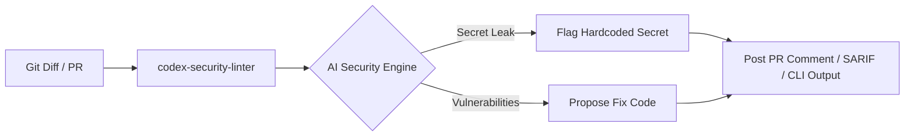

# Codex Security Linter 🛡️

[](https://opensource.org/licenses/MIT)
[](https://github.com/knmt1219/codex-security-linter/releases)
[](https://www.python.org/)
[](https://github.com/marketplace)

An open-source security linter that operates as a **GitHub Action**, **Pre-commit Hook**, and **Local CLI Tool** to detect secret leaks, injection flaws, and vulnerabilities across code diffs with automated remediation suggestions and SARIF reporting.

---

## 🏗️ Architecture Overview



---

## ✨ Key Features

- **Secret & Token Leak Detection**: Instantly catches hardcoded API keys, private certificates, and tokens with rapid regex heuristics.
- **Vulnerability Auditing**: Analyzes code diffs for SQLi, XSS, Command Injection, and SSRF flaws using LLMs.
- **Remediation Suggestions**: Generates secure code replacements with GitHub suggestion formatting directly in PR comments.
- **SARIF Report Export**: Generates industry-standard SARIF reports (`--sarif`) for GitHub Code Scanning integration.
- **Pre-commit Hook Support**: Prevents insecure commits locally before they reach the repository.
- **Flexible Runtimes**: Works as a Python package (`pip install .`), GitHub Action, or standalone CLI.

---

## 💻 Local CLI Usage

Run a security audit directly on your local uncommitted changes or recent commits:

```bash
# 1. Install package / dependencies
pip install .

# 2. Set OpenAI API Key (optional for heuristic scan, required for deep AI audit)
export OPENAI_API_KEY="sk-xxxxxxxxxxxxxxxxxxxxxxxx"

# 3. Run audit on local git diff
codex-security-linter --local

# 4. Optional: Export scan results to SARIF
codex-security-linter --local --sarif results.sarif
```

---

## 🪝 Pre-commit Hook Integration

Add Codex Security Linter to your `.pre-commit-config.yaml`:

```yaml
repos:
  - repo: https://github.com/knmt1219/codex-security-linter
    rev: v1.3.0
    hooks:
      - id: codex-security-linter
```

---

## 🚀 GitHub Action Quick Setup

Add `.github/workflows/security.yml` to your repository:

```yaml
name: Security Audit
on:
  pull_request:
    types: [opened, synchronize]

jobs:
  audit:
    runs-on: ubuntu-latest
    steps:
      - uses: actions/checkout@v4
      - uses: knmt1219/codex-security-linter@v1.3.0
        with:
          github-token: ${{ secrets.GITHUB_TOKEN }}
          openai-api-key: ${{ secrets.OPENAI_API_KEY }}
          model: 'gpt-4o-mini'
```

---

## ⚙️ Configuration (`.codex-security.yml`)

You can customize the linter behavior using `.codex-security.yml`:

```yaml
version: 1.0
settings:
  model: "gpt-4o-mini"
  severity_threshold: "MEDIUM"
ignore_paths:
  - "tests/*"
  - "docs/*"
  - "*.lock"
rules:
  secret_leak_detection: true
  injection_flaws: true
  deserialization_risks: true
```

---

## 📄 License

This project is licensed under the MIT License - see the [LICENSE](LICENSE) file for details.
