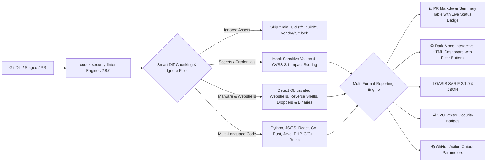

# Codex Security Linter 🛡️

[](https://opensource.org/licenses/MIT)
[](https://github.com/knmt1219/codex-security-linter/releases)
[](https://www.python.org/)
[](https://hub.docker.com/)
[](https://github.com/marketplace)
[](https://github.com/knmt1219/codex-security-linter)
[](https://github.com/knmt1219/codex-security-linter)

**Codex Security Linter** is an open-source, enterprise-grade AI security auditing and linting engine. It operates seamlessly as a **GitHub Action**, **Pre-commit Hook**, **Docker Container**, and **Cross-Platform CLI Tool** to detect secret leaks, injection flaws, webshells, malware payloads, and security vulnerabilities across code diffs in **Python**, **JavaScript/TypeScript**, **React**, **Go**, **Rust**, **Java**, **PHP**, and **C/C++** with automated remediation suggestions, CVSS 3.1 scoring, confidence estimation, execution performance metrics, smart diff chunking, dark-mode interactive HTML dashboards with real-time severity filters, direct status badge embedding in PR comments, and SARIF/JSON reporting.

---

## 🏗️ Architecture Overview



---

## ✨ Key Features

- 🦠 **Malware, Webshell & Reverse Shell Detection**:
  - **Obfuscated Webshells**: Identifies stealthy PHP evasion scripts (`eval(base64_decode(...))`, `assert(gzinflate(...))`, `str_rot13`).
  - **Interactive Reverse Shells**: Detects bash/TCP reverse shells (`/dev/tcp/x.x.x.x/port`, `bash -i >& /dev/tcp`), and netcat backdoors (`nc -e /bin/sh`).
  - **Piped Remote Execution**: Flags malicious download & execute droppers (`curl | bash`, `wget | sh`).
  - **Encoded PowerShell Droppers**: Spots obfuscated base64 encoded commands (`powershell -enc ...`).
  - **Suspicious Binary & Script Artifacts**: Flags dangerous compiled binaries and executable scripts (`.exe`, `.dll`, `.so`, `.elf`, `.vbs`, `.bat`, `.cmd`, `.scr`) introduced in diffs.
- 📊 **Executive Security Summary Table**: Formats all audit findings into a high-visibility Markdown matrix table (Severity badge, Type, CVSS, Confidence %, Code snippet).
- 🏷️ **Direct PR Comment Status Badges**: Automatically embeds real-time visual status badges (`Codex Audit: PASSED` / `Codex Audit: ISSUES FOUND`) at the top of Pull Request comments.
- 🌐 **Dark Mode Interactive HTML Dashboard (`--html`)**: Generates a sleek, modern, standalone HTML5/CSS security report with real-time severity filter buttons (All, Critical, High) and interactive search.
- 🦀 **Comprehensive Multi-Language Vulnerability Scanning**:
  - **Python**: Dynamic execution (`eval`, `exec`), command injection (`subprocess shell=True`), insecure deserialization (`pickle.loads`).
  - **JavaScript / TypeScript / React**: Cross-site scripting (`dangerouslySetInnerHTML`).
  - **Go**: SQL injection risks via `fmt.Sprintf` query construction, dangerous memory manipulation (`unsafe.Pointer`).
  - **Rust**: Memory safety violations and unconstrained `unsafe` code blocks.
  - **Java**: Dangerous command execution (`Runtime.getRuntime().exec`, `ProcessBuilder`), insecure deserialization (`XMLDecoder`), SQL injection via string concatenation (`executeQuery`, `executeUpdate`).
  - **PHP**: Remote command execution (`system`, `shell_exec`, `passthru`, `proc_open`), object deserialization vulnerabilities (`unserialize`).
  - **C / C++**: Buffer overflow vulnerabilities (`gets`, `strcpy`, `strcat`), dangerous format string risks (`sprintf`).
- ⚡ **Smart Diff Chunking Optimizer**: Intelligently parses and prioritizes security-critical diff hunks for large PRs to maximize LLM context efficiency.
- ⏱️ **Real-Time Performance Metrics**: Displays detailed scan statistics (lines analyzed, execution duration in milliseconds, issue counts).
- 🎯 **Staged Changes Scanning (`--staged`)**: Audit git staged index changes (`git diff --cached`) before committing to the repository.
- 🧹 **Smart Minified & Bundled File Filtering**: Automatically ignores compiled/bundled artifacts (`*.min.js`, `*.bundle.js`, `dist/*`, `build/*`, `vendor/*`, `*.lock`) to eliminate false positives.
- 🖼️ **Automated SVG Security Badges (`security-badge.svg`)**: Automatically generated in GitHub Actions and available on CLI (`--badge`) for embedding in READMEs and CI dashboards.
- 🐳 **Docker Container Support**: Pre-packaged ultra-lightweight Docker image (`python:3.11-slim`) for seamless containerized execution in any CI/CD environment.
- ⚙️ **Custom Configuration Path (`--config`)**: Flexible policy customization via `.codex-security.yml` or custom file paths.
- 📤 **GitHub Action Output Parameters**: Emits `findings-count`, `has-critical`, `sarif-path`, and `html-report-path` to `$GITHUB_OUTPUT` for downstream CI/CD workflow automation.
- 🤫 **Quiet Mode (`--quiet`)**: Silent CLI execution mode for clean pre-commit hooks that only produces output when security flaws are detected.
- 🛑 **Configurable Fail-On Threshold (`--fail-on`)**: Automatically fails the CI build (`exit code 1`) if vulnerabilities meet or exceed your specified threshold (`CRITICAL`, `HIGH`, `MEDIUM`, or `LOW`).
- 🔑 **Secret & Token Leak Detection with Masking**: Catches hardcoded API keys, private certificates, and tokens with rapid regex heuristics, automatically masking sensitive values (`AKIA...12`).
- 🎯 **CVSS 3.1 Impact Scoring & Confidence Matrix**: Assigns standard CVSS severity scores and confidence percentages to all detected security findings.
- 📄 **Multi-Format Export Support**: Exports findings to industry-standard **SARIF** (`--sarif`), structured **JSON** (`--json`), and interactive **HTML** (`--html`).
- 💡 **One-Click GitHub Suggestions**: Generates secure code replacements formatted as GitHub suggestions (````suggestion ... ````) directly in PR comments.
- 🪝 **Pre-commit Hook Integration**: Prevents insecure commits locally before they reach the repository.
- ⚡ **Cross-Platform**: Full native support for **Windows (PowerShell/CMD)**, **macOS (zsh/bash)**, **Linux (Ubuntu/Debian/Arch)**, and **Docker**.

---

## 💻 Cross-Platform Installation & Local CLI Usage

### 🪟 1. Windows (PowerShell & CMD)

#### Prerequisites
- Python 3.10+ installed (ensure **"Add Python to PATH"** is checked during installation)
- Git installed

#### Step 1: Clone Repository & Set Up Virtual Environment
**PowerShell:**
```powershell
# Clone repository
git clone https://github.com/knmt1219/codex-security-linter.git
cd codex-security-linter

# Create and activate virtual environment
python -m venv .venv
.\.venv\Scripts\Activate.ps1

# Install package
pip install -e .
```

**Command Prompt (CMD):**
```cmd
REM Clone repository
git clone https://github.com/knmt1219/codex-security-linter.git
cd codex-security-linter

REM Create and activate virtual environment
python -m venv .venv
.venv\Scripts\activate.bat

REM Install package
pip install -e .
```

#### Step 2: Configure OpenAI API Key
**PowerShell:**
```powershell
$env:OPENAI_API_KEY="sk-xxxxxxxxxxxxxxxxxxxxxxxx"
```

**Command Prompt (CMD):**
```cmd
set OPENAI_API_KEY=sk-xxxxxxxxxxxxxxxxxxxxxxxx
```

#### Step 3: Run Local Security Audit
```powershell
# Run heuristic, malware & AI audit on local uncommitted git diff
codex-security-linter --local

# Scan staged changes before committing
codex-security-linter --staged

# Export dark-mode interactive HTML dashboard report and SARIF/JSON
codex-security-linter --local --html security-report.html --json findings.json --sarif results.sarif

# Stop process (exit code 1) on CRITICAL vulnerabilities
codex-security-linter --local --fail-on CRITICAL

# Scaffold pre-commit configuration file
codex-security-linter --install-hook

# Generate SVG status badge
codex-security-linter --local --badge
```

---

### 🍎 2. macOS (Terminal / zsh / bash)

#### Prerequisites
- Python 3.10+ (`brew install python` via Homebrew)
- Git installed (`xcode-select --install` or `brew install git`)

#### Step 1: Clone Repository & Set Up Virtual Environment
```bash
# Clone repository
git clone https://github.com/knmt1219/codex-security-linter.git
cd codex-security-linter

# Create and activate virtual environment
python3 -m venv .venv
source .venv/bin/activate

# Install package
pip install -e .
```

#### Step 2: Configure OpenAI API Key
```bash
# Set for current session
export OPENAI_API_KEY="sk-xxxxxxxxxxxxxxxxxxxxxxxx"

# (Optional) Persist in ~/.zshrc or ~/.bash_profile
echo 'export OPENAI_API_KEY="sk-xxxxxxxxxxxxxxxxxxxxxxxx"' >> ~/.zshrc
source ~/.zshrc
```

#### Step 3: Run Local Security Audit
```bash
# Run heuristic & AI audit on local git diff
codex-security-linter --local

# Audit staged changes quietly
codex-security-linter --staged --quiet

# Generate dark-mode interactive HTML dashboard and SVG badge
codex-security-linter --local --html security-report.html --badge

# Enforce fail-on threshold in CI
codex-security-linter --local --fail-on HIGH
```

---

### 🐧 3. Linux (Ubuntu / Debian / Arch / Fedora)

#### Prerequisites
```bash
# Ubuntu / Debian
sudo apt update && sudo apt install -y python3 python3-pip python3-venv git

# Arch Linux
sudo pacman -S python python-pip git

# Fedora / RHEL
sudo dnf install -y python3 python3-pip git
```

#### Step 1: Clone Repository & Set Up Virtual Environment
```bash
# Clone repository
git clone https://github.com/knmt1219/codex-security-linter.git
cd codex-security-linter

# Create and activate virtual environment
python3 -m venv .venv
source .venv/bin/activate

# Install package
pip install -e .
```

#### Step 2: Configure OpenAI API Key
```bash
# Set for current session
export OPENAI_API_KEY="sk-xxxxxxxxxxxxxxxxxxxxxxxx"

# (Optional) Persist in ~/.bashrc
echo 'export OPENAI_API_KEY="sk-xxxxxxxxxxxxxxxxxxxxxxxx"' >> ~/.bashrc
source ~/.bashrc
```

#### Step 3: Run Local Security Audit
```bash
# Run heuristic & AI audit on local git diff
codex-security-linter --local

# Scan staged changes quietly
codex-security-linter --staged --quiet

# Export complete multi-format reports including dark-mode HTML dashboard
codex-security-linter --local --html security-report.html --json findings.json --sarif results.sarif --badge

# Fail build if any CRITICAL or HIGH vulnerabilities are detected
codex-security-linter --local --fail-on HIGH
```

---

### 🐳 4. Docker Container Usage

Run Codex Security Linter inside an isolated Docker container without installing Python locally:

#### Build Docker Image
```bash
# Build lightweight Docker container image
docker build -t codex-security-linter:v2.8.0 .
```

#### Run Security Audit via Docker
```bash
# Audit current repository mounted into container
docker run --rm \
  -v "$(pwd):/app/repo" \
  -w /app/repo \
  -e OPENAI_API_KEY="sk-xxxxxxxxxxxxxxxxxxxxxxxx" \
  codex-security-linter:v2.8.0 --local --html security-report.html --fail-on HIGH
```

---

## 🎛️ CLI Options & Flags Reference

| Option / Flag | Type | Description |
| :--- | :---: | :--- |
| `--local` | Flag | Run security audit on local uncommitted `git diff`. |
| `--staged` | Flag | Run security audit on staged changes (`git diff --cached`). |
| `--config <path>` | String | Path to custom YAML configuration file (default: `.codex-security.yml`). |
| `--install-hook` | Flag | Automatically scaffold a `.pre-commit-config.yaml` file in the current directory. |
| `--quiet` | Flag | Quiet mode: suppress informational logs and only output when vulnerabilities/secrets are found. |
| `--html <path>` | String | Export interactive Dark Mode HTML5 security dashboard report (e.g., `--html security-report.html`). |
| `--fail-on <level>` | Choice | Exit with code `1` if findings meet or exceed severity (`CRITICAL`, `HIGH`, `MEDIUM`, `LOW`). |
| `--strict` | Flag | Shorthand for `--fail-on HIGH` (exits with code `1` on `CRITICAL` or `HIGH` risks). |
| `--badge` | Flag | Explicitly generate a vector SVG status badge (`security-badge.svg`) on CLI. |
| `--json <path>` | String | Export structured scan results to a JSON file (e.g., `--json findings.json`). |
| `--sarif <path>` | String | Export scan results to OASIS SARIF 2.1.0 format (e.g., `--sarif results.sarif`). |

---

## 📤 GitHub Action Outputs Reference

| Output Variable | Type | Description |
| :--- | :---: | :--- |
| `findings-count` | Number | Total count of security flaws, malware, and secret leaks detected. |
| `has-critical` | Boolean | `true` if any `CRITICAL` vulnerability was detected; `false` otherwise. |
| `sarif-path` | String | Path to the generated SARIF report file. |
| `html-report-path` | String | Path to the generated interactive HTML report file. |

---

## 🪝 Pre-commit Hook Integration

Prevent insecure code, webshells, and hardcoded secrets from ever being committed:

### Method 1: Auto-generate `.pre-commit-config.yaml`
```bash
codex-security-linter --install-hook
```

### Method 2: Manual Configuration
Add Codex Security Linter to your `.pre-commit-config.yaml`:

```yaml
repos:
  - repo: https://github.com/knmt1219/codex-security-linter
    rev: v2.8.0
    hooks:
      - id: codex-security-linter
```

Then install the pre-commit hook:
```bash
pip install pre-commit
pre-commit install
```

---

## 🚀 GitHub Action Quick Setup

Automate security audits on every Pull Request and consume output parameters.

### 1. Add Repository Secret
In your GitHub repository, navigate to **Settings > Secrets and variables > Actions** and add:
- `OPENAI_API_KEY`: Your OpenAI API key (`sk-...`).

### 2. Create Workflow File
Create `.github/workflows/security.yml` in your repository:

```yaml
name: Security Audit

on:
  pull_request:
    types: [opened, synchronize, reopened]

permissions:
  contents: read
  pull-requests: write
  issues: write

jobs:
  security-audit:
    name: Codex AI Security Linter
    runs-on: ubuntu-latest
    steps:
      - name: Checkout repository
        uses: actions/checkout@v4

      - name: Run Codex Security Linter
        id: security-linter
        uses: knmt1219/codex-security-linter@v2.8.0
        with:
          github-token: ${{ secrets.GITHUB_TOKEN }}
          openai-api-key: ${{ secrets.OPENAI_API_KEY }}
          model: 'gpt-4o-mini'
          fail-on: 'HIGH'
          html: 'security-report.html'
          sarif: 'results.sarif'

      - name: Upload Security Report Artifact
        if: always()
        uses: actions/upload-artifact@v4
        with:
          name: security-report
          path: ${{ steps.security-linter.outputs.html-report-path }}

      - name: Check Critical Vulnerabilities
        if: steps.security-linter.outputs.has-critical == 'true'
        run: echo "🚨 Critical vulnerabilities detected in Pull Request!"
```

---

## ⚙️ Configuration (`.codex-security.yml`)

Customize scanning behavior by creating a `.codex-security.yml` file in your repository root:

```yaml
version: 2.8
settings:
  model: "gpt-4o-mini"
  severity_threshold: "MEDIUM"
ignore_paths:
  - "tests/*"
  - "docs/*"
  - "*.lock"
rules:
  secret_leak_detection: true
  malware_and_webshells: true
  injection_flaws: true
  deserialization_risks: true
  memory_safety_checks: true
```

---

## 🔒 Security & Privacy

- **Diff-Only Transmission**: Only modified code diffs (`git diff`) are audited; entire source trees are never uploaded.
- **Smart Artifact Filtering**: Automatically excludes minified, bundled, and build assets.
- **Automatic Secret Masking**: Detected credentials and tokens are masked before being included in reports to prevent secondary exposure.
- **Enterprise Safe**: Compatible with OpenAI Enterprise data privacy policies.

---

## 📄 License

This project is open-source and licensed under the [MIT License](LICENSE) (Copyright © 2026 Hồ Minh Tuấn).
